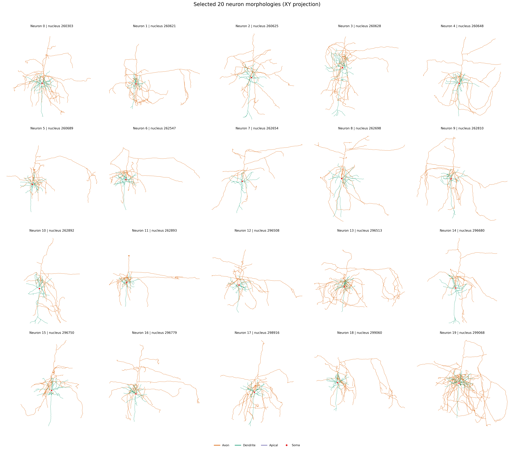
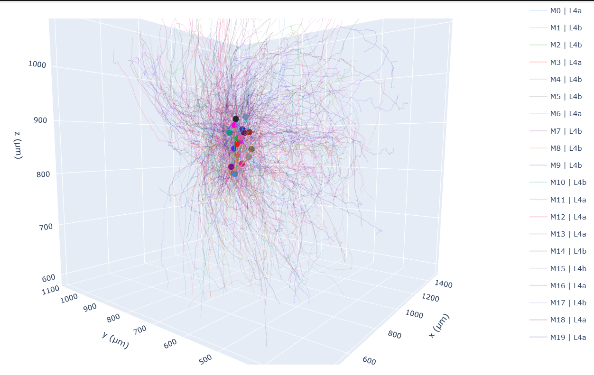
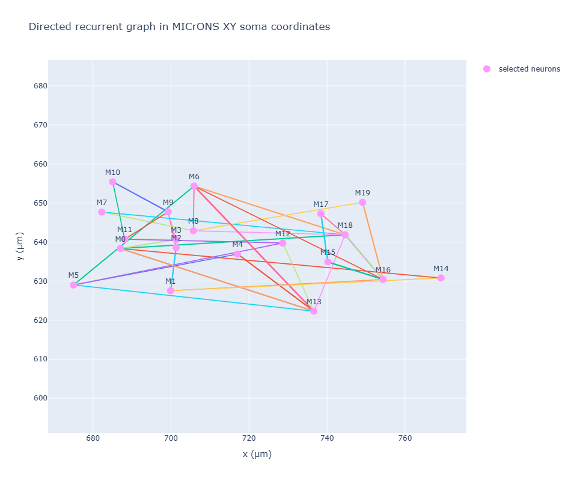
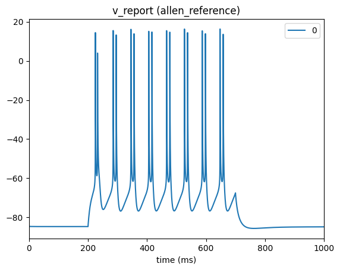
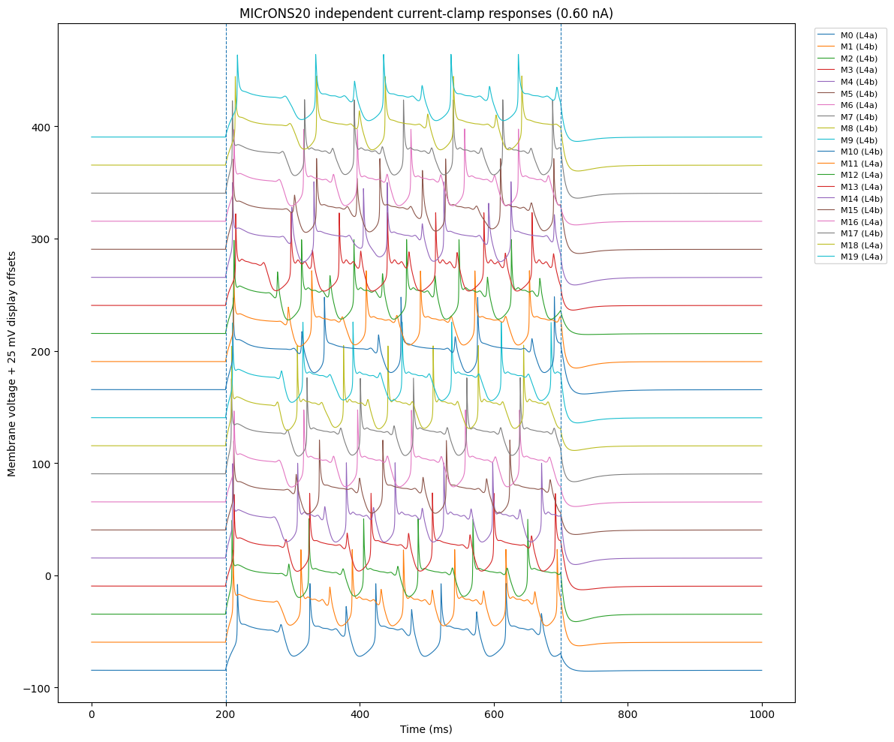
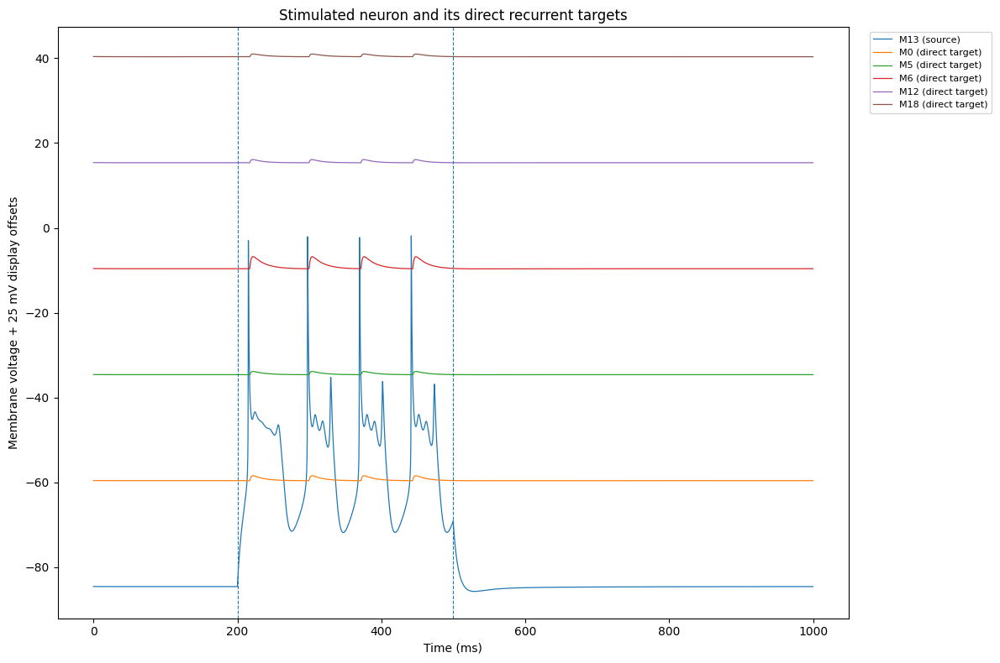

# MICrONS20 Microcircuit

**From MICrONS CAVE data to an executable 20-neuron recurrent microcircuit, with the longer-term goal of modelling missing external drive and validating the model against MICrONS functional activity.**

This repository is a working proof of concept for building a small, traceable MICrONS V1 circuit from public data. It covers the complete path from data access and neuron selection to morphology processing, synapse placement, SONATA export and preliminary BioNet/NEURON simulation.

The structural part of the circuit is grounded in MICrONS data. The present cellular and synaptic physiology is deliberately provisional: one [Allen Cell Types](https://celltypes.brain-map.org/data) Layer-4 perisomatic model is used as a reference membrane model, and the first recurrent simulation uses a simple excitatory `Exp2Syn` model. The aim at this stage is to demonstrate that the selected MICrONS circuit can be carried through to a working multicompartment simulation without presenting the current electrical model as a fitted MICrONS model.

## Current result

The present build contains:

- **20 excitatory V1 neurons** from MICrONS session 9 / scan 3;
- **9 L4a and 11 L4b cells**;
- **22 functional mappings** retained for the 20 selected neurons;
- **20 CAVE-derived simulation morphologies**;
- **38 directed recurrent neuron pairs**;
- **54 observed recurrent synaptic contacts**;
- **44,282 observed incoming contacts** from **29,991 presynaptic roots outside the selected 20-cell subset**;
- a validated structural SONATA representation;
- successful independent simulation of all 20 transferred cell models;
- a working recurrent 20-cell BioNet/NEURON simulation.

In the current recurrent experiment, model 13 is chosen automatically from the observed connectivity as the stimulated source. It has five direct recurrent targets: models 0, 5, 6, 12 and 18. The source fires during the current step and the direct targets show postsynaptic depolarisations. No unstimulated cell reaches spike threshold under the present reference synaptic parameters.

## Selected results

The repository includes a small set of figures intended to make the current result easy to inspect without rerunning the simulations.

### 2D morphology of all 20 neurons



This figure shows the XY projection of all 20 selected CAVE-derived neuron morphologies.

### Structural microcircuit



Twenty CAVE-derived morphologies are shown together in the MICrONS coordinate frame.

### Recurrent connectivity in MICrONS space



The selected 20-cell network contains 38 directed connected pairs represented by 54 observed recurrent synaptic contacts.

### Allen reference model



The Allen Cell Types Layer-4 perisomatic model is first reproduced with its original morphology and mechanisms before any parameter transfer to MICrONS morphologies.

### Twenty MICrONS morphologies with shared reference physiology



All 20 selected MICrONS morphologies can be instantiated and simulated with the same Allen-derived reference parameter set. This is a compatibility and morphology-response check, not a cell-specific physiological fit.

### Recurrent source and direct targets



Only the selected source neuron receives direct current. Its direct targets show postsynaptic responses through the observed recurrent contacts under the current reference `Exp2Syn` parameters.

## Repository structure

```text
configs/                 project, simulation and synapse settings
data/
  raw/                   downloaded/source snapshots and cached CAVE skeletons
  interim/               stage-to-stage working artifacts
  external/              third-party model files used locally
  processed/             selected population, morphologies, connectivity and SONATA
docs/                    detailed scientific and technical documentation
notebooks/
  pipeline/              structural pipeline, stages 00-10
  analysis/              structural inspection and visualisation
  simulation/            reference, single-cell, population and recurrent simulations
provenance/              stage records, hashes and build information
results/
  tables/                QC and compact result tables
  figures/               selected application-facing figures
runs/                    generated BioNet/NEURON run directories
scripts/                 execution and repository utilities
src/microns20/           reusable Python implementation
tests/                   automated structural checks
```

Large source/intermediate data, downloaded Allen model files, compiled NEURON mechanisms and generated simulation run directories are intentionally excluded from Git. They remain reproducible from the versioned code, configuration and documented data sources.

## Documentation

For a first reading:

1. [`docs/PROJECT_OVERVIEW.md`](docs/PROJECT_OVERVIEW.md) — scientific aim and current status.
2. [`docs/PIPELINE.md`](docs/PIPELINE.md) — complete data-to-simulation workflow.
3. [`docs/REPOSITORY_GUIDE.md`](docs/REPOSITORY_GUIDE.md) — what each directory and major file is used for.
4. [`docs/SCIENTIFIC_DECISIONS.md`](docs/SCIENTIFIC_DECISIONS.md) — morphology, connectivity, simulation and modelling decisions.
5. [`docs/SIMULATION.md`](docs/SIMULATION.md) — Allen reference model, parameter transfer and recurrent simulation.
6. [`docs/REPRODUCIBILITY.md`](docs/REPRODUCIBILITY.md) — installation and rerunning the workflow.
7. [`docs/FUTURE_WORK.md`](docs/FUTURE_WORK.md) — functional-data retrieval, e-model development, external-input modelling and validation.
8. [`docs/DATA_AND_PROVENANCE.md`](docs/DATA_AND_PROVENANCE.md) — data sources, attribution and provenance.
9. [`docs/KNOWN_LIMITATIONS.md`](docs/KNOWN_LIMITATIONS.md) — current scientific and software limitations.

## Reproducing the structural pipeline

### 1. Create the environment

```bash
git clone <repository-url>
cd microns20-microcircuit

conda env create -f environment.yml
conda activate microns20

pip install -e .
```

### 2. Configure MICrONS CAVE access

The structural pipeline requires a personal CAVE authentication token.

Authentication credentials are kept outside the repository and should not be added to `configs/`, notebooks, source code, or Git history.

For first-time CAVE authentication setup and verification, see:

[`docs/REPRODUCIBILITY.md`](docs/REPRODUCIBILITY.md)

The scientific data-source and selection settings are stored separately in:

```text
configs/project.yaml
```

### 3. Run the structural pipeline

The pipeline notebooks can be executed sequentially with:

```bash
python scripts/execute_pipeline_notebooks.py
```

This runs:

```text
00_source_preflight
01_candidate_discovery
02_cave_morphology_eligibility
03_recording_selection
04_connectivity_selection
05_final_qc_and_manifest
06_functional_identity
07_simulation_morphologies
08_synapse_mapping
09_structural_sonata
10_end_to_end_validation
```

The pipeline recreates source/intermediate artifacts that are not stored in Git and writes the selected structural outputs under `data/processed/`, `results/tables/` and `provenance/`.

## Running the simulations

Simulation-specific settings are stored under:

```text
configs/simulations/
configs/synapses/
```

The current sequence is:

```text
notebooks/simulation/00_allen_reference.ipynb
notebooks/simulation/01_microns_single_cell_transfer.ipynb
notebooks/simulation/02_microns20_independent_current_clamp.ipynb
notebooks/simulation/03_microns20_recurrent_network.ipynb
```

The Allen Cell Types model is a third-party dependency and is not committed to this repository. The current reference is:

```text
neuronal model ID: 487245719
specimen ID:       486893033
reconstruction ID: 512328466
```

The required local files and compilation step are documented in [`docs/REPRODUCIBILITY.md`](docs/REPRODUCIBILITY.md) and [`docs/SIMULATION.md`](docs/SIMULATION.md).

Generated simulation directories are written under `runs/`. They are intentionally ignored by Git because they contain regenerated network copies, simulation HDF5 reports, compiled/platform-specific files and duplicated model components. The compact results that are useful for inspection are kept under `results/`.

## What comes directly from MICrONS?

The current repository uses MICrONS data for:

- neuron identity and functional-coregistration identifiers;
- V1, cell-type and proofreading annotations used for selection;
- CAVE skeleton geometry and compartment labels;
- observed recurrent and incoming synaptic contacts;
- postsynaptic synapse locations used for section placement.

The current simulation additionally introduces modelling assumptions:

- one Allen Layer-4 perisomatic parameter set shared across the selected neurons;
- the current-clamp protocols used to exercise the models;
- `Exp2Syn` kinetics, conductance and delay for the first recurrent simulation;
- omission of the outside-selected20 input population from the present recurrent run.

Keeping these two categories separate is central to the interpretation of the current result.

## Tests

Run:

```bash
python -m pytest -q
```

These tests check selected identity, morphology processing, functional-mapping multiplicity, synapse preservation, SONATA consistency, provenance and other structural invariants. The simulation branch has been executed successfully but still needs dedicated automated tests before it should be treated as a stable physiological modelling package.

## Current scientific boundary

The present work demonstrates that a MICrONS-derived 20-neuron structural circuit can be carried through to an executable multicompartment recurrent simulation.

It does **not** yet establish that the membrane dynamics, firing rates, synaptic responses or population state reproduce the recorded MICrONS biology.

The main next steps are:

- retrieve the matched functional activity through MICrONS NDA v8;
- establish a principled comparison between calcium/deconvolved activity and simulated spikes;
- replace the shared Allen reference physiology with better morphology-aware e-models;
- improve synaptic physiology;
- classify the observed input sources outside the selected 20-cell subset;
- model the missing external drive;
- calibrate and validate the circuit against the functional recordings.

See [`docs/FUTURE_WORK.md`](docs/FUTURE_WORK.md) for the detailed plan.

## Data, attribution and licensing

The structural pipeline is pinned to MICrONS CAVE materialisation 1822 and skeleton version 4 through configuration.

MICrONS materials used by this project are subject to the MICrONS citation and attribution requirements. The preliminary electrical reference model is an Allen Institute model and remains a third-party resource.

See [`docs/DATA_AND_PROVENANCE.md`](docs/DATA_AND_PROVENANCE.md) before redistributing data or model files.

